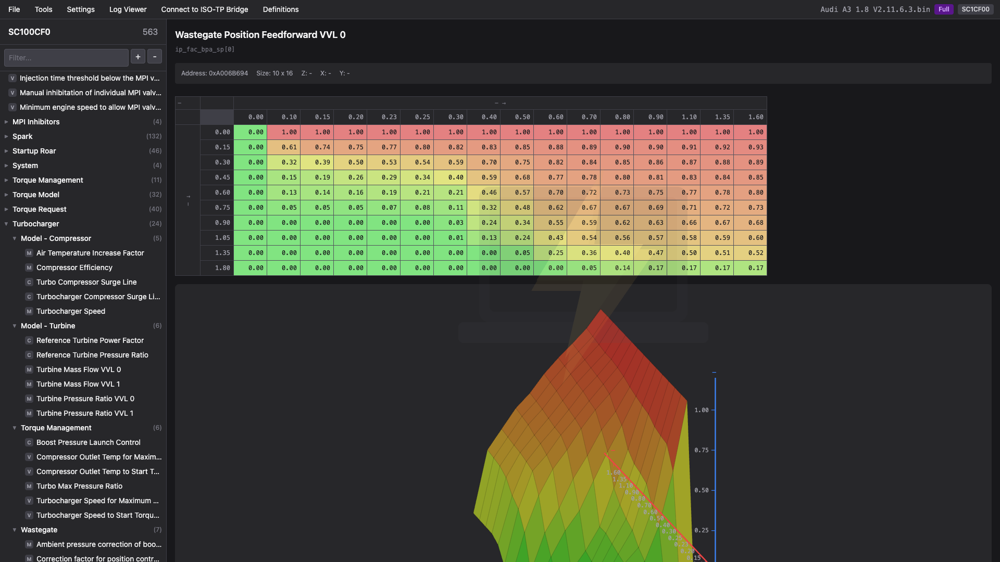

# Tune Editor

A web-based ECU tuning editor for viewing and modifying calibration data in BIN files using A2L/XDF definitions.

**[Live Demo](https://theflashbold.github.io/tune-editor/)**




## Features

- **Multi-Format Support**: A2L, XDF (TunerPro), and JSON definition formats
- **Auto-Detection**: Automatically matches binary files to definitions via EPK verification
- **BIN File Editor**: View and edit scalar values, curves (1D tables), and maps (2D tables)
- **3D Visualization**: Interactive 3D surface graph for MAP parameters (mouse-draggable rotation/tilt)
- **2D Graphs**: Line charts for CURVE parameters
- **Heatmap Visualization**: Logarithmic color-coded table cells from green (low) to red (high)
- **Compare Mode**: Load an original BIN file to compare changes side-by-side
- **Editable Axes**: Modify X and Y axis breakpoints directly
- **Batch Editing**: Select multiple cells and apply add/multiply/set operations
- **Change Tracking**: Visual indicators for modified values with diff view
- **Category Tree**: Organize parameters by categories with fuzzy search
- **Keyboard Navigation**: Navigate parameters with arrow keys
- **BLE Datalogger**: Connect to ESP32 datalogger for real-time ECU monitoring

## Usage

1. **Load Definition**: Open a JSON definition file or use the A2L Converter
2. **Load BIN File**: Open your ECU binary file
3. **Edit Values**: Double-click on any value to edit
4. **Compare (optional)**: Load an original BIN to see changes highlighted
5. **Save**: Export the modified BIN file

## A2L Converter

The built-in converter parses ASAP2 (A2L) files and extracts:
- CHARACTERISTIC definitions (VALUE, CURVE, MAP)
- COMPU_METHOD conversion formulas
- AXIS_PTS breakpoint tables
- RECORD_LAYOUT data types and storage order

Optionally use a CSV file to filter and categorize parameters.

## Tech Stack

- [Preact](https://preactjs.com/) - Fast 3kB React alternative
- [Vite](https://vitejs.dev/) - Next generation frontend tooling
- [Tailwind CSS](https://tailwindcss.com/) - Utility-first CSS framework
- TypeScript

## Development

```bash
npm install
npm run dev
```

## Build

```bash
npm run build
```

## License
Provided as is, no support or guarantee


MIT
