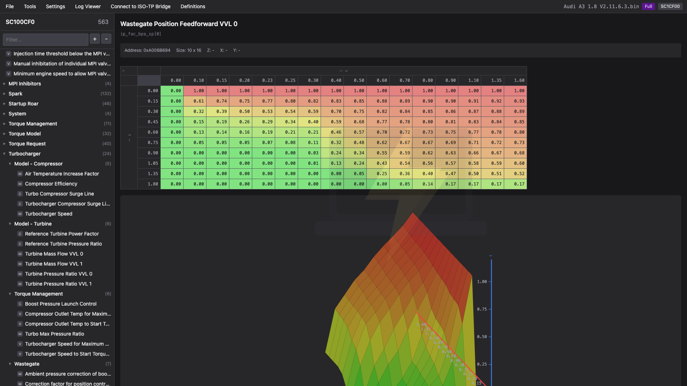
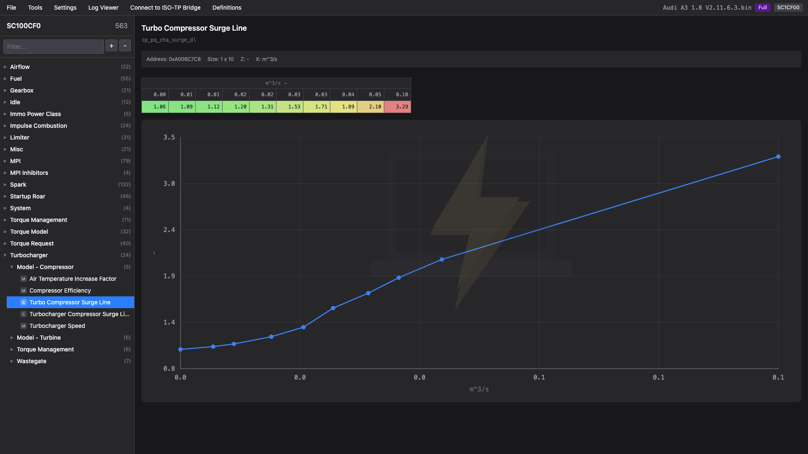

# Tune Editor

A feature-complete web-based ECU tuning editor, comparable to WinOLS and TunerPro, just in your browser.
View and modify calibration data in BIN files using JSON, A2L, XDF definitions (experimental OLS support).

**[Live Version - Start now!](https://theflashbold.github.io/tune-editor/)**




## Usage

1. **Load BIN File**: Open your ECU binary file
2. **Load Definition**: The Editor loads the correct definition, otherwise drop a .json .xdf .a2l
3. **Edit Values**: Modify tables and values
4. **Compare (optional)**: Load an original BIN to see changes highlighted. You can also cross compare bins, parameters are matched by name.
5. **Save**: Export the modified BIN file

## Features

- **Auto-Detection**: Automatically matches binary files to definitions via EPK verification
- **Multi-Format Support**: A2L, XDF (TunerPro), and JSON definition formats
- **BIN File Editor**: View and edit scalar values, curves (1D tables), and maps (2D tables)
- **3D Visualization**: Interactive 3D surface graph for MAP parameters (mouse-draggable rotation/tilt) WebGL accelerated
- **2D Graphs**: Line charts for CURVE parameters
- **Heatmap Visualization**: Color-coded table cells from green to red
- **Compare Mode**: Load an original BIN file to compare changes side-by-side
- **Cross-Compare Mode**: Load a different BIN file to compare changes over two definitions side-by-side
- **Editable Axes**: Modify X and Y axis breakpoints directly
- **Batch Editing**: Select multiple cells and apply add/multiply/set operations
- **Change Tracking**: Visual indicators for modified values with diff view
- **Category Tree**: Organize parameters by categories with fuzzy search
- **Keyboard Navigation**: Navigate parameters with arrow keys

## Included definitions

### VAG ECU

| Boxcode    | SW-Version | EPK     | Note           |
|------------|------------|---------|----------------|
| 06K906071C | 8100       | SC8V30  |                |
| 3G0906259G | 0004       | SCGA05  |                |
| 3GD906259B | 0003       | SCG910  |                |
| 5G0906259A | 0004       | SC8H64  |                |
| 5G0906259F | 0001       | SC8O200 |                |
| 5G0906259P | X621       | SC8LB70 |                |
| 5G0906259S | 0002       | SCGA10  |                |
| 5G0906259  | 0010       | SC8F900 |                |
| 8U0906259A | 0003       | SC8H85  |                |
| 8V0906259A | 0004       | SC8H65  |                |
| 8V0906264E | 0003       | SC1CF00 | A3 1.8 Europe  |
| 8V0906264H | 0003       | SC8O30  | A3 1.8 Europe  |
| 8V0906259F | 0002       | SC8O30  | S3 Europe      |
| 3G0906259  | 0003       | SC8O30  | Golf 2.0       |
| 3G0906264  | 0003       | SC8O30  | Superb 1.8     |
| 5G0906259F | 0002       | SC8O30  | Leon 2.0       |
| 5G0906259J | 0002       | SC8O30  | Golf R         |
| 5NG906264  | 0002       | SC8O30  | Tiguan 1.8     |
| 5TD906264  | 0002/0003  | SC8O30  | Tiguan 1.8     |
| 8VD906264A | 0002/0003  | SC8O30  | A5 1.8         |
| 8V0906264K | 0003       | SC8S50  | A3 1.8 US      |
| 5G0906259L | 0002       | SC8S50  | Golf 2.0       |
| 5G0906259H | 0001       | SC8S50  | Leon 2.0 Cupra |
| 5N0906259  | 0003       | SC8S50  | Tiguan 2.0 R   |
| 5N0906259B | 0001       | SC8S50  | Tiguan 2.0     |
| 8S0906259A | 0003       | SC8S50  | TT 2.0         |
| 8S0906259C | 0004       | SC8S50  | TT 2.0         |
| 8S0906259L | 0001       | SC8S50  | TT 2.0         |
| 8V0906259J | 0003       | SC8S50  | Golf / S3 2.0  |
| 8V0906259K | 0003       | SC8S50  | S3 2.0         |
| 8V0906259P | 0001       | SC8S50  | Golf 2.0       |
| 8V0906259T | 0002       | SC8S50  | Golf 2.0       |
| 8V0906264M | 0001       | SC8S50  | Golf 1.8       |

### VAG DSG TCU

| Boxcode    | SW-Version | EPK  |
|------------|------------|------|
| 0D9300012L | 4517       | F45M |
| 0D9300012  | 4930       | F49M |
| 0D9300014N | 5002       | F50M |
| 0D9300018D | 5201       | F52M |
| 0D9300040J | 4027       | F40M |
| 0D9300040S | 4311       | F43M |

## Patching

Built-in support for [Switchleg1/BinToolz](https://github.com/Switchleg1/BinToolz) `.btp` patch files. Compatible
patches are automatically detected when a binary is loaded.

| Patch        | Description                                                   |
|--------------|---------------------------------------------------------------|
| SL PATCH     | Multimaps, Rolling Anti-Lag, Launch Control, Traction Control |
| SL HSL       | Highspeed Logging                                             |
| Immo         | Immobilizer                                                   |
| SWG          | Simple Wastegate Control                                      |
| SL CBRICK    | CBOOT Brick Protection                                        |
| FREE SAP     | Secondary Air Pump delete                                     |
| CAT          | Catalyst monitoring delete                                    |
| DQ250 HSL    | DSG Highspeed Logging                                         |
| Torque Limit | DSG DQ250 Torque Limit Increase                               |

Patches with bundled XDF definitions automatically add their parameters to the category tree under "Patch". Custom
`.btp` files can also be loaded via the file picker in the Patches dialog.

## Tech Stack

- [Preact](https://preactjs.com/) - Fast 3kB React alternative
- [Vite](https://vitejs.dev/) - Next generation frontend tooling
- [Tailwind CSS](https://tailwindcss.com/) - Utility-first CSS framework
- TypeScript

## Development

```bash
npm install
npm run dev
```

## Build

```bash
npm run build
```

## License

Provided as is, no support or guarantee

GPL-3.0
